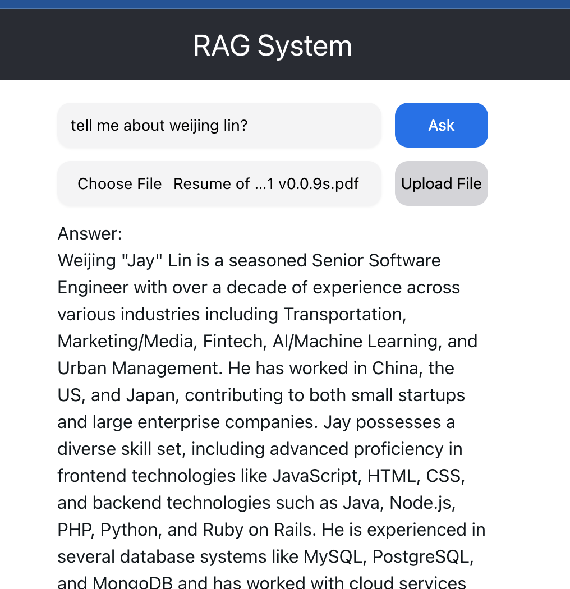

# Pthon React RAG




## Preperation

1. setup your pincone account and fill up the evn
2. follow the script on `get started` to install and run the program

## Get Started

start backend service

```sh
cd backend
pip install -r requirements.txt
uvicorn main:app --reload
```

start frontend client

```sh
cd ../frontend
npm install
npm start
```

happy to play

> the following quick start script might not be perfect due to lack of time to
complete it. Welcome to contribute it.

```sh
chmod +x ./start.sh
./start.sh
```

## Reference

[https://chatgpt.com/share/addf719e-36e1-4330-a16c-3f7f72a836b0](https://chatgpt.com/share/addf719e-36e1-4330-a16c-3f7f72a836b0)
